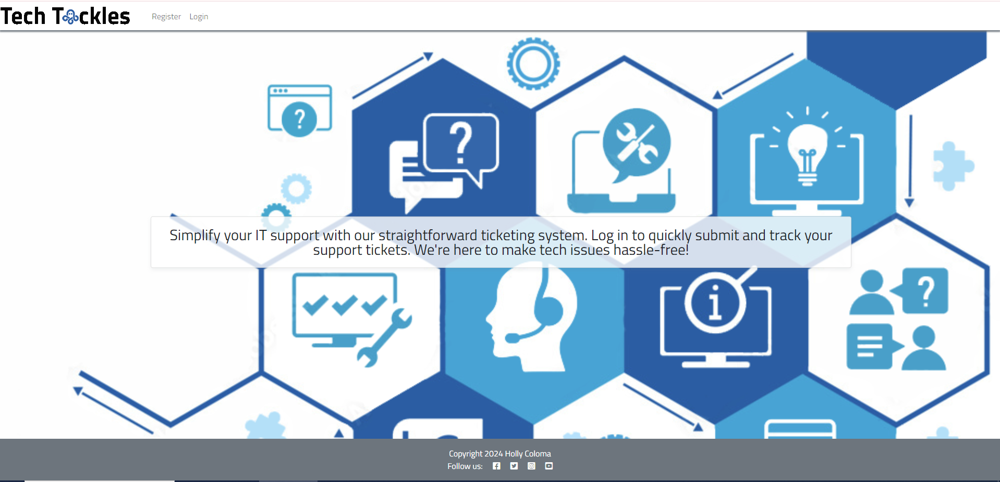

# Tech Tackles- IT Support Ticketing System

# Table of Contents
- [Project Introduction](#project-introduction)
  - [Tech Tackles](#screenshot)
  - [Link to Live Project](#link-to-live-project)
  - [Objective](#objective)
- [UX/UI Design](#uxui)
  - [The Strategy Plane](#the-strategy-plane)
  - [The Scope Plane](#the-scope-plane)
  - [The Skeleton Plane](#the-skeleton-plane)
  - [The Structure Plane]()
  - [The Surface Plane]()

## Project Introduction

Welcome to Tech Tackles, your go-to IT Support Ticketing System designed to streamline and simplify your IT support processes. Our system is built to help organizations efficiently manage and resolve IT-related issues.

Our IT Support Ticketing System is crafted to provide a user-friendly platform for logging, tracking, and resolving IT support requests. Whether you're an IT professional seeking a reliable solution for ticket management or an end-user needing swift assistance, Tech Tackles is here to support you.

With an intuitive web interface, users can easily submit tickets, track progress, and communicate with IT specialists.

The project will include front-end development with HTML, CSS, and JavaScript, and back-end development using Python and Django.

## 

### [Link to Live project](https://pp4-techtackles-by-hc-ed362e72006b.herokuapp.com/)

### Objective
The objective of this project is to develop a comprehensive IT asset management application to assist IT administrators in efficiently managing their IT assets. This application will be designed using a combination of front-end and back-end technologies, including HTML, CSS, JavaScript, Python, and Django

## UX/UI Design
### The Strategy Plane

#### VISION

To create a user-friendly application that is designed to streamline and simplify and enhances the efficiency of IT support processes, improves user satisfaction, and reduces resolution times.

#### OBJECTIVES
- Streamline the process of ticket submission and management.
- Enhance IT support staff collaboration.
- Enable administrators to manage the system efficiently.

#### USER NEEDS
- End-Users (Employees/Customers)
    - Easy Ticket Submission, simple and quick process to submit support tickets.
      
- IT Support Staff
    - Efficient tools for ticket management.

- Administrators
    - User Management: Tools to manage users and roles effectively.
    - Ticket Management: Ability to update and delete tickets

### The Scope Plane 
#### FEATURES
- User Management
  - User Registration and Login (via Django AllAuth)
  - Profile Management (Admin, User, Tech Support roles)
  
- Ticket Management:
  - Ticket Creation, Viewing, and Deletion
  - Ticket Editing (by owner or tech support)
  - Ticket Status Updates (Open, In Progress, Closed)
  - Commenting on Tickets (with editing and deletion options)
  
- Comment Management:
  - Adding comments to tickets
  - Editing and deleting comments
  - Viewing comments in a modal window

- Notification System:
  - Popup messages for ticket updates, delete and comment actions

- Admin Panel:
  - Managing users and roles
  - Viewing all tickets and comments

- Filtering:
  - Filtering tickets by status

#### FUNCTIONAL SPECIFICATIONS
- User Registration and Login:
  - Implemented using Django AllAuth
  - Registration form with email verification
  - Login with email and password

- Profile Management:
  - Edit profile information (name, email, password)
  - View user roles and permissions
  - Admin interface for role management

- Ticket Management:
  - Ticket creation form with subject and description
  - Ticket detail view with all ticket information and comments
  - Edit and delete options for tickets
  - Status update options available to tech support

- Comment Management:
  - Form for adding new comments
  - Edit and delete options for comments (in a modal window)
  - Display comments in the ticket detail view

- Notification System:
  - JavaScript for showing popup messages
  - Backend logic for setting success or error messages
  
- Admin Panel:
  - Django admin interface for user and ticket management
  - Advanced search and filtering options

- Filtering:
  - Dropdowns or filters for ticket status

#### USER STORIES

As a User:
  - I want to register for an account so that I can submit and track support tickets.
  -  I want to log in to my account, so that I can access the IT Support Ticketing System.
  - I want to submit ticket so that I can get help with my issues.
  - I want to view my submitted tickets, so that I can track their status.
  - I want to edit my submitted tickets with status open, so that I can update the information if necessary.
  - I want to view all comments on my own ticket so that I can track support responses and updates.
- I want to add comments to my tickets so that I can communicate with support if I have follow up questions that relates to the ticket's subject.
- I want to edit my comment so that I can correct or update the information.
- I want to delete my submitted tickets with status open, so that I can remove requests that are no longer needed or relevant.
- I want to log out of my account so that I can ensure my account is secure when I'm not using it.

As a tech support:
  - I want to manage all tickets so that I can resolve issues.
  - I want to change the status of open and in progress tickets so that I can manage the progress of support requests.
  - I want to add comments to open and in progress tickets so that I can communicate with user of the resolution relevant to the ticket's subject
  - I want to edit comments on tickets so that I can provide accurate information and updates
  - I want to manage all tickets so that I can resolve issues.
  - I want to delete my comments on open and in progress tickets so that I can remove inappropriate or irrelevant content

As an admin:
  - I want to manage user accounts in the admin panel so that I can add, edit, or delete users
  - I want to view all tickets and comments so that I can oversee support activities.
  - I want to manage user roles so that I can control access to the system.

### The Skeleton Plane 
#### LAYOUT STRUCTURE

Home Page:
  - Header: Navigation bar with links to Register, Login, and (if authenticated) Logout.
  - Main Section: Brief introduction to Tech Tackles.
  - Footer: Copyright information and social media links.

Login Page:
  - Header: Navigation bar with links to Register, and Login.
  - Main Section: Login form with username and password fields, and a "Log In" button.
  - Footer: Copyright information and social media links.

Register Page:
  - Header: Navigation bar with links to Register, and Login.
  - Main Section: Registration form with fields for username, email, and password, password confirmation and a "Register" button.
  - Footer: Copyright information and social media links.

User Dashboard (after login):
  - Header: Navigation bar with links to All Tickets (if staff or admin), My Tickets (if user)  and Logout.
  - Main Section: Links to Create Ticket, Filter by Status, Table with a list of tickets showing Ticket ID, Status, Subject, Created On (date only), and User.
  - Footer: Copyright information and social media links.

Ticket Detail Page:
  - Header: Navigation bar.
  - Main Section:
    - Ticket details: Ticket ID, Submitted by, Created On, Updated On, Status, Subject, Details.
    - Edit/Delete options for ticket (if allowed).
    - List of comments with edit/delete options for each comment (if allowed).
    - Form to add a new comment.
  
### The Structure Plane

#### INFORMAITON ARCHITECTURE

Global Navigation:
  - Register (visible when not logged in)
  - Login (visible when not logged in)
  - Logout (visible when logged in)
  - All Tickets (visible to tech support and admins)
  - My Tickets (visible to user)

#### CONTENT ORGANIZATION

Home Page:
  - Welcome message
  - Links to register or login

Login Page:
  - Form with email and password fields

Register Page:
  - Form with fields for email, username, and password

Ticket List Page:
  - Table of tickets with columns for Ticket ID, Status, Subject, Created On (date only), and User

Ticket Detail Page:
  - Detailed view of the selected ticket
  - List of comments
  - Form to add new comments
  - Edit/Delete options for ticket and comments (if allowed)

#### INTERFACE ELEMENTS:
Forms:
  - User Registration Form: Input validation for email, username, password and password confirmation fields
  - Login Form: Input validation for email and password fields
  - Ticket Form: Input validation for subject and description fields and status (hidden field or dropdown for tech support).
  - Comment Form:  Input validation for comment text

Buttons:
  - Primary buttons for actions like "Register", "Log In", "Logout", "Create Ticket", "Submit", "Edit", "Delete", "Next", "Last", "First", and "Previous".
  - Secondary buttons for action like "Cancel", "Close", and "Save Changes".

Tables:
  - Ticket List: Columns for Ticket ID, Status, Subject, Created On (date only), and User. Clickable rows to view ticket details, pagination.
  - Ticket List for Mobile: Columns for Ticket ID and Status.

Modals:
  - For editing comments to avoid navigating away from the ticket detail page. Opens when the "Edit" button is clicked on a comment, contains the comment text pre-filled, and has a save button to update the comment
  - For deleting ticket and comments.

Alerts:
  - For success and error messages, displayed using Bootstrap alerts for actions like creating tickets, adding comments, updating tickets, etc..
  - For Access Denied and 404 Error using a customised page.

#### CONTENT REQUIREMENTS:
Home Page Content:
  - Brief introduction to Tech Tackles
  - Links to register or login

Login Page Content:
  - Login form with fields for email and password
  - Link to the registration page

Register Page Content:
  - Registration form with fields for email, username, and password

Ticket List Page Content:
  - Table displaying tickets with columns for Ticket ID, Status, Subject, Created On (date only), and User
  - Links to view ticket details

Ticket Detail Page Content:
  - Detailed view of the selected ticket with fields like Ticket ID, Submitted - by, Created On, Updated On, Status, Subject, and Description
  - List of comments associated with the ticket
  - Form to add new comments
  - Edit/Delete options for ticket and comments (if allowed)

#### INTEACTION DESIGN:
Ticket Creation:
  - User fills out the ticket form and submits.
  - System validates input and creates a ticket.
  - Success message is shown.
  - System will display newly created ticket with an option to edit/delete.

Editing Ticket:
  - User clicks "Edit" on a ticket
  - Redirect to a page to update ticket with the text pre-filled.
  - User updates the ticket with the option to update status if admin/staff and then save changes
  - System validates and updates the ticket.
  - Success message is shown, and the updated ticket is displayed.

Commenting:
  - User adds a comment via the form.
  - System validates input and adds the comment.
  - Comment appears below the ticket details with an option to edit/delete (if allowed).

Editing Comments:
  - User clicks "Edit" on a comment.
  - Modal opens with the comment text pre-filled.
  - User updates the comment and saves changes.
  - System validates and updates the comment.
  - Success message is shown, and the updated comment is displayed.

-	Flowchart/Database Schema - https://drawsql.app/ Entity Relationship Diagram

### The Surface Plane - the actual interface that users see and interact with
- Colour Scheme
-	Fonts Used
-	Images
- Features – Actual website
  - Function 1
  - Function 2
  - Function 3
## Future Feature Considerations
## Testing
  - User Story Testing
  - Automated testing
  - CI Python Linter – 
  - Lighthouse
  - Mobile
  - Desktop
  - W3C CSS Validator
  - W3C HTML validator
  - JSHint for Javascript
  - Other Testing
    - Functionality Testing
    - Compatibility Testing – different devices
    - Crossbrowser testing
## Agile Development

To ensure the TECH TACKLES IT Support Ticketing System is developed effectively and efficiently, we will follow an agile approach. This will involve iterative development cycles (sprints) where we continuously build, test, and refine the system. Here's how we can break down the development process into iterations:

#### Iteration 0: Planning and Setup
- Goals:

Define project objectives, user stories, and initial requirements.
Set up the development environment.
Create initial project structure and repository.
T
- Tasks:

Create and initialize a Git repository.
Set up Django project and application.
Configure Django AllAuth for user authentication.
Create initial models for User, Ticket, and Comment.
Set up static files and templates structure.

#### Iteration 1: User Authentication and Role Management

- Goals:

  Implement user authentication.
  Define and implement user roles (Admin, User, Tech Support).
- Tasks:

  Implement login, signup, and logout functionality using Django AllAuth.
  Create user roles and permissions.
  Implement user management in the admin dashboard.
  Test user authentication and role management.
- Deliverables:

  Functional user authentication system.
  User roles and permissions implemented.
  Basic admin interface for user management.

#### Iteration 2: Ticket Management
- Goals:

  Implement ticket creation, viewing, and listing.
- Tasks:

  Create forms for ticket creation and updating.
  Implement views for creating, listing, and viewing tickets.
  Implement ticket status (Open, In Progress, Closed).
  Test ticket creation and viewing functionalities.
- Deliverables:

  Functional ticket creation form.
  List view of tickets with status filters.
  Detail view for individual tickets.

#### Iteration 3: Commenting and Interaction
- Goals:

  Implement ticket commenting system.
  Ensure interaction between users and tech support through comments.
- Tasks:

  Create comment model and forms.
  Implement views for adding and viewing comments.
  Restrict comment access based on user roles.
  Test commenting functionality.
- Deliverables:

  Functional commenting system.
  Users can add comments to their own tickets.
  Tech support can add comments to all tickets.
#### Iteration 4: Admin and Tech Support Features
- Goals:

  Implement additional features for admin and tech support users.
- Tasks:

  Allow tech support to edit and delete tickets.
  Enable admin to assign tickets to tech support.
  Implement admin dashboard for ticket management.
  Test admin and tech support features.
- Deliverables:

  Admin and tech support can manage tickets.
  Admin dashboard for user and ticket management.
#### Iteration 5: Notification System and UX Improvements
- Goals:

  Implement a notification system for success and error messages.
  Improve the user interface and experience.
- Tasks:

  Integrate Django messages framework for notifications.
  Create custom JavaScript for popup messages.
  Improve CSS for better layout and design.
  Test the notification system and UI.
- Deliverables:

  Functional notification system for user actions.
  Improved UI with responsive design.
#### Iteration 6: Testing and Bug Fixing
- Goals:

  Ensure the system is fully functional and bug-free.
- Tasks:

  Perform comprehensive testing of all features.
  Fix any bugs or issues found during testing.
  Ensure all user stories are met.
- Deliverables:

  Fully tested and functional IT support ticketing system.
  Documentation for testing procedures and results.
#### Iteration 7: Deployment and Documentation
- Goals:

  Deploy the application to a production environment.
  Create comprehensive documentation.
- Tasks:

  Set up and configure the production environment.
  Deploy the application.
  Write detailed documentation for installation, usage, and contribution.
  Create a README file with all necessary information.
- Deliverables:

  
  Deployed application.
  Comprehensive documentation and README.
#### Iteration 8: Feedback and Iteration
- Goals:

  Gather feedback from users and stakeholders.
  Implement improvements based on feedback.
- Tasks:

  Collect feedback through surveys or user testing sessions.
  Prioritize and implement changes based on feedback.
  Plan for future iterations or updates.
- Deliverables:

  Feedback report.
  Updated application with improvements based on feedback.
#### Continuous Improvement
Even after the initial development and deployment, continuous improvement is key. Regularly gather feedback, monitor the application's performance, and plan for future updates and new features to ensure TECH TACKLES continues to meet user needs effectively.

By following this agile approach with clear iterations, we ensure that the development of the TECH TACKLES IT Support Ticketing System is structured, efficient, and responsive to user needs.
## Bugs and Potential issues

## Technologies and language
## Development
## Deployment on Heroku
## Credits
## Acknowledgement
