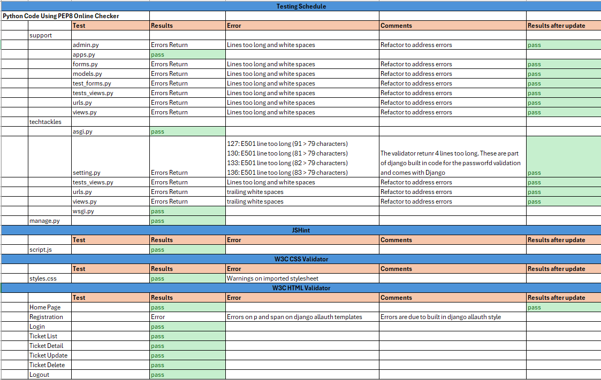
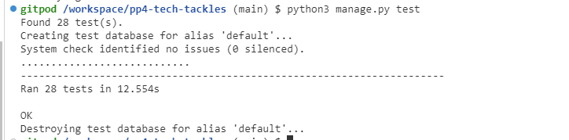
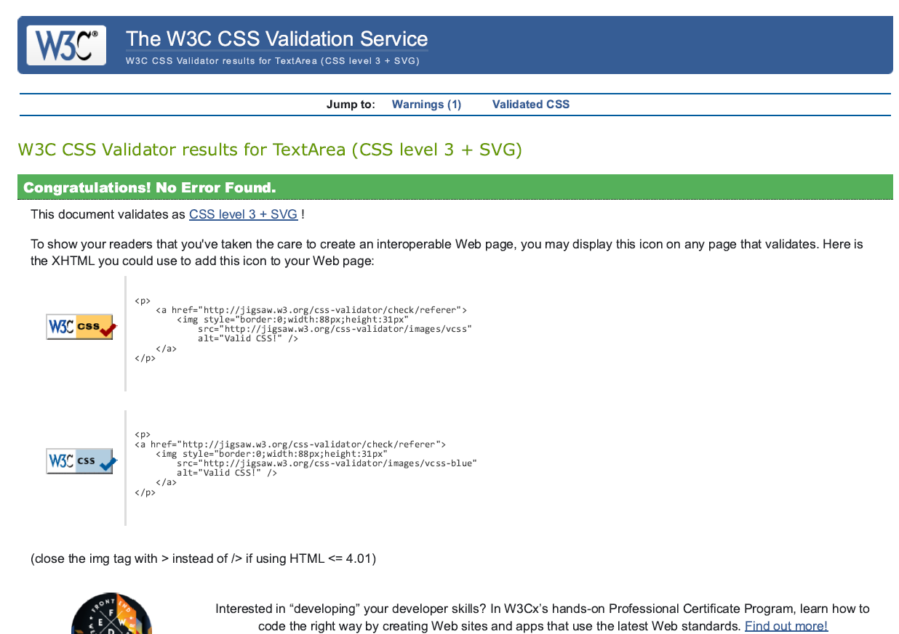
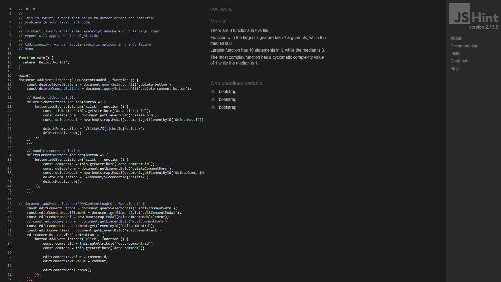

 # TESTING SUMMARY
 
 ## User Story Testing
 ### As a User
 **Register for an Account**
- Test Case 1: Navigate to the registration page and complete the form with valid information. Verify that the user is redirected to the home page and that a confirmation message is displayed.
- Test Case 2: Attempt to register with invalid or incomplete information. Verify that appropriate error messages are displayed.

**Log In to My Account**
- Test Case 1: Log in with valid credentials and verify that the user is redirected to the ticket dashboard.
- Test Case 2: Log in with invalid credentials and verify that an error message is displayed.

**Submit a Ticket**
- Test Case 1: Fill out and submit a ticket form with valid details. Verify that the ticket is created and appears in the user's list of tickets.
- Test Case 2: Submit a ticket with missing or invalid information. Verify that appropriate error messages are displayed.

**View My Submitted Tickets**

- Test Case 1: Navigate to the tickets list and verify that all submitted tickets are displayed correctly.
- Test Case 2: Ensure that the ticket status is correctly updated in the list.

**Edit My Submitted Tickets**

- Test Case 1: Edit a ticket with the status 'open' and verify that changes are saved and reflected in the ticket list.
- Test Case 2: Attempt to edit a ticket with a status other than 'open' and ensure that editing is is not available

**View All Comments on My Ticket**

- Test Case 1: Open a ticket and verify that all associated comments are displayed.
- Test Case 2: Ensure that comments are updated in real-time or upon refreshing the page.

**Add Comments to My Tickets**

- Test Case 1: Add a comment to a ticket and verify that it appears under the ticket.
- Test Case 2: Attemot to add comment on closed projects, add comment is not available. 

**Edit My Comment**

- Test Case 1: Edit a comment and verify that the updated comment is displayed correctly.
- Test Case 2: Ensure that only the comment author can edit their comments.

**Delete My Submitted Tickets**

- Test Case 1: Delete a ticket with the status 'open' and verify that it is removed from the list.

**Log Out of My Account**

- Test Case 1: Log out and verify that the user is redirected to the login page.
- Test Case 2: Verify that the user session is properly terminated and that access to secure pages is restricted.

### As a Tech Support
**Manage All Tickets**

- Test Case 1: Access the ticket list page and verify that all tickets are listed and can be accessed.
- Test Case 2: Verify that the tech support user can view and interact with ticket details.

**Change the Status of Tickets**

- Test Case 1: Change the status of an open ticket to 'in progress' or 'closed' and verify that the change is reflected in the system.
- Test Case 2: Ensure that status changes are logged and updated in real-time.

**Add Comments to Tickets**

- Test Case 1: Add comments to an open or in-progress ticket and verify that comments are displayed correctly.
- Test Case 2: Verify that comments can only be added to tickets that are open or in progress.

**Edit Comments on Tickets**

- Test Case 1: Edit a comment on a ticket and verify that the changes are saved and displayed correctly.
- Test Case 2: Ensure that only the author of the comment can edit comments.

**Delete Comments on Tickets**

- Test Case 1: Delete a comment from a ticket and verify that it is removed from the ticket.
- Test Case 2: Ensure that only the author of the comment or tech support can delete comments.

### As an Admin
**Manage User Accounts**

- Test Case 1: Access the admin panel and verify that user accounts can be added, edited, or deleted.
- Test Case 2: Ensure that changes to user accounts are reflected immediately.

**View All Tickets and Comments**

- Test Case 1: Access the ticket and comments overview and verify that all tickets and comments are visible.
- Test Case 2: Ensure that the admin can filter and sort tickets and comments as needed.

**Manage User Roles**

- Test Case 1: Change user roles in the admin panel and verify that role changes are applied and enforced.
- Test Case 2: Ensure that users with different roles have access only to permitted features.

 ## Automated Testing
 To ensure the robustness and reliability of the Tech Tackles IT Support Ticketing System, we have implemented a comprehensive suite of automated tests. These tests cover critical functionalities of the system, ensuring that all features perform as expected and that any changes or additions do not introduce regressions. There are 28 tests done and all test ran OK.
 

 Here's a brief overview of the tests implemented:
 
 ### Form Tests

**CommentFormTest**

- Valid Comment Form: Tests if a valid comment form is accepted.
- Invalid Comment Form: Ensures the form validation fails for empty comments.

**TicketFormTest**

- Valid Ticket Form: Verifies that a valid ticket form is accepted.
- Invalid Ticket Form: Checks for form validation failures with missing subject.

**TicketUpdateFormTest**

- Admin Permissions: Ensures that admins can update all fields in a ticket.
- Staff Permissions: Confirms that staff can update ticket status but not subject or description.
- Regular User Permissions: Verifies that regular users can update subject and description but not status.

**StatusFilterFormTest**

- All Statuses: Tests if the form accepts empty status for filtering.
Open Status: Checks for correct validation with 'Open' status.
- Invalid Status: Ensures validation fails for invalid status values.

### View Tests
**TicketViewsTest**

- Home Page Redirects for Anonymous Users: Ensures anonymous users are redirected correctly.
- Home Page for Authenticated Users: Checks if authenticated users see the correct page.
- Ticket List View for Authenticated Users: Verifies that the ticket list view is accurate and includes submitted tickets.
- Ticket Detail View for Staff and Owners: Confirms staff and ticket owners can view ticket details.
- Ticket Detail View for Non-Owners: Ensures non-owners are redirected if they try to access tickets they don’t own.
- Ticket Create View: Tests ticket creation functionality.
- Ticket Update View: Validates that ticket updates are saved correctly.
- Ticket Delete View: Ensures tickets can be deleted and are removed from the system.
- Add Comment View: Checks that new comments are added successfully to tickets.
- Edit Comment View: Tests if existing comments can be edited and updated.
- Delete Comment View: Verifies that comments can be deleted from tickets.
- No Access View: Ensures that users without permission see the no access page.

**CustomLoginViewTest**

- Login Page Renders Correctly: Validates that the login page loads with the correct form.
- Successful Login Redirects: Tests if users are redirected correctly upon successful login.
- Invalid Login Shows Error: Ensures that invalid login attempts show the appropriate error message.
- Invalid Login No User: Checks that attempts with non-existent users return the correct error.

### Custom404ViewTest

- Custom 404 View: Verifies that accessing a non-existent page shows the custom 404 error page.

These tests cover critical functionalities including form validation, user permissions, and view access, ensuring a robust and reliable user experience.

 ## Python Validation

 In Python, validation is a crucial process to ensure that data inputs and operations conform to expected formats and rules, helping to maintain data integrity and application stability.

 - [support/admin.py](static/images/testing/pep8_support_admin.PNG)
 - [support/apps.py](static/images/testing/pep8_support_apps.PNG)
 - [support/forms.py](static/images/testing/pep8_support_forms.PNG)
 - [support/models.py](static/images/testing/pep8_support_models.PNG)
 - [support/tests_forms.py](static/images/testing/pep8_support_test_forms.PNG)
 - [support/testst_views.py](static/images/testing/pep8_support_tests_views.PNG)
 - [support/urls.py](static/images/testing/pep8_support_urls.PNG)
 - [support_views.py](static/images/testing/pep8_support_views.PNG)
 - [techtackles/asgi.py](static/images/testing/pep8_techtackles_asgi.PNG)
 - [techtackles/settings.py](static/images/testing/pep8_techtackles_settings.PNG)
 - [techtackles/tests_views.py](static/images/testing/pep8_techtackles_tests_views.PNG)
 - [techtackles/urls.py](static/images/testing/pep8_techtackles_urls.PNG)
 - [techtackles/views.py](static/images/testing/pep8_techtackles_views.PNG)
 - [techtackles/wsgi.py](static/images/testing/pep8_techtackles_wsgi.PNG)
 - [manage.py]()
 ## Lighthouse
 Click on the link to see results of Lighthouse testing
 ### Mobile
 - [Home Page](static/images/testing/lighthouse_homepage_m.PNG)
 - [Login](static/images/testing/lighthouse_login_m.PNG)
 - [Logout](static/images/testing/lighthouse_logout_m.PNG)
 - [Registration](static/images/testing/lighthouse_registration_m.PNG)
 - [Ticket List](static/images/testing/lighthouse_ticketlist_m.PNG)
 - [Ticket Detail](static/images/testing/lighthouse_ticketdetail_m.PNG)
 - [Ticket Update](static/images/testing/lighthouse_ticketupdate_m.PNG)
 
 ### Desktop
 - [Home Page](static/images/testing/lighthouse_homepage.PNG)
 - [Login](static/images/testing/lighthouse_login.PNG)
 - [Logout](static/images/testing/lighthouse_logout.PNG)
 - [Registration](static/images/testing/lighthouse_registration.PNG)
 - [Ticket List](static/images/testing/lighthouse_ticketlist.PNG)
 - [Ticket Detail](static/images/testing/lighthouse_ticketdetail.PNG)
 - [Ticket Update](static/images/testing/lighthouse_ticketupdate.PNG)

 ## CSS Validation
CSS validation was conducted for the Tech Tackles IT Support Ticketing System to ensure that all stylesheets adhere to the latest web standards and best practices. This process helps guarantee that the site's appearance is consistent across different browsers and devices, enhancing both usability and user experience. By validating CSS, we ensure that the stylesheets are free from errors and are optimized for performance and compatibility.
 

 ## HTML Validation
HTML validation was conducted on each page of the Tech Tackles IT Support Ticketing System to ensure adherence to web standards and best practices.
Below are screenshots of results. Complete HTML validation results can be found [here.](static/documents)

 - [Home Page](static/images/testing/valid_homepage.PNG)
 - [Login](static/images/testing/valid_login.PNG)
 - [Logout](static/images/testing/valid_logout.PNG)
 - [Registration](static/images/testing/valid_registration.PNG)
 - [Ticket List](static/images/testing/valid_ticketlist.PNG)
 - [Ticket Detail](static/images/testing/valid_ticketdetail.PNG)
 - [Ticket Update](static/images/testing/valid_ticketupdate.PNG)

 ## JSHint for Javascript
 For Tech Tackles IT Support Ticketing System, JSHint validation was performed to ensure that all JavaScript code is clean, consistent, and follows best practices.

 
 ## Other Testing
 ### Functionality Testing
 Functionality testing was conducted to ensure that all features of the Tech Tackles IT Support Ticketing System operate as expected. This type of testing focuses on verifying that each feature fulfills its intended purpose and adheres to the specified requirements. Key aspects covered include:

- User Registration and Login: Validated that users can successfully register, log in, and log out, and that their sessions are properly managed.
- Ticket Management: Ensured that users can create, view, edit, and delete tickets, and that staff and admins can manage and resolve tickets efficiently.
- Comment Functionality: Tested the ability to add, edit, and delete comments on tickets, including permissions for different user roles.
- User Roles and Permissions: Verified that different user roles (regular users, tech support, and admin) have the appropriate access and control over various functionalities.
- Error Handling: Checked that the system handles errors gracefully and provides meaningful feedback to users.

This thorough testing process ensures that the Tech Tackles system delivers a seamless, reliable, and user-friendly experience across all its functionalities.
 ### Compatibility Testing – different devices
 - Desktop Computers: Testing was conducted across various screen sizes and resolutions to ensure that the application’s layout and functionality remain intact on standard desktop monitors.
 - Laptops: Compatibility testing included different operating systems (Windows, macOS) and resolutions to verify that the user interface adapts appropriately.
 - Tablets: The application was tested on various tablets, including both Android and iOS devices, to ensure touch interactions and screen orientation adjustments function as expected.
 - Mobile: Testing on multiple smartphones ensured that the application is fully responsive, providing an optimal user experience on various Android and iOS devices with different screen sizes and resolutions.

 ### Crossbrowser Testing
Cross-browser testing ensures that the Tech Tackles IT Support Ticketing System functions consistently and correctly across different web browsers. Given the variety of browsers used by individuals, it is vital to verify that the application delivers a uniform user experience regardless of the browser or its version.

**Browsers Tested:**

- Google Chrome: As one of the most widely used browsers, compatibility testing was performed on various versions of Chrome to ensure full functionality and correct display.
- Mozilla Firefox: Testing included different versions of Firefox to confirm that the application maintains its integrity and performance.
- Microsoft Edge: Both the legacy version and the newer Chromium-based version of Edge were tested to verify compatibility and consistency.
- Safari: The application was tested on Safari, particularly focusing on macOS and iOS versions to ensure proper functionality and appearance on Apple devices.